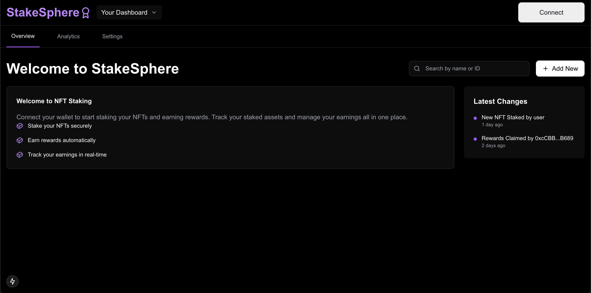
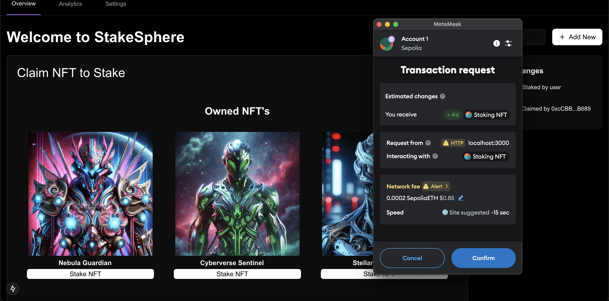

# StakeSphere

## Overview
StakeSphere is an NFT Staking Application that allows users to connect their wallets, claim an NFT (if they don't have one), stake their NFTs for rewards, and withdraw staked NFTs. The application also provides staking rewards for staked NFTs, incentivizing users to participate actively. The app ensures secure blockchain interactions through a streamlined process involving two transactions for approval and staking.



---

## Features

- **Wallet Connection**: Users can connect their wallets to interact with the application.
- **NFT Claiming**: Users who do not own any NFTs can claim one to begin staking.
- **NFT Staking**: Stake NFTs securely to earn rewards.
- **NFT Withdrawal**: Withdraw any NFT that has been staked at any time.
- **Staking Rewards**: Users earn rewards for the duration their NFTs are staked.
- **Transaction Flow**: Two transactions are performed during staking:
  1. Approval of the NFT for staking.
  2. Staking of the NFT.

---


## Tech Stack

- **Frontend**: [Next.js](https://nextjs.org/) for server-rendered React applications.
- **Styling**: [TailwindCSS](https://tailwindcss.com/) for a responsive and modern UI.
- **Blockchain SDK**: [Thirdweb](https://thirdweb.com/) for NFT and blockchain interaction.
- **Language**: TypeScript for type-safe development.

---


## Installation and Setup

### Prerequisites
- Node.js and npm installed on your machine.
- Wallet provider (e.g., MetaMask) installed and configured.
- Access to a blockchain network supporting NFTs (e.g., Ethereum or Polygon).


### Steps
1. Clone the repository:
   ```bash
   git clone https://github.com/your-repo/stakesphere.git
   cd stakesphere
   ```

2. Install dependencies:
   ```bash
   npm install
   ```

3. Configure environment variables:
   Create a `.env.local` file in the root directory and add your blockchain provider, Thirdweb API keys, and other required credentials.

4. Start the development server:
   ```bash
   npm run dev
   ```

5. Open the application in your browser at `http://localhost:3000`.

---

## How It Works



1. **Connect Wallet**:
   Users connect their wallet using the wallet connect button. Supported wallets include MetaMask, Coinbase Wallet, and others.

2. **Claim NFT**:
   If a user doesn't own any NFT, they can claim one via the "Claim NFT" button. The application checks the user's wallet before allowing staking.

3. **Stake NFT**:
   - Users select an NFT from their wallet.
   - The app prompts two transactions:
     1. Approval of the NFT.
     2. Staking of the NFT.
   - Once staked, users begin earning rewards.

4. **Withdraw NFT**:
   Users can withdraw any staked NFT back to their wallet. Rewards are calculated and distributed based on the staking duration.

---


## Folder Structure
```
src/
|-- components/     # Reusable UI components
|-- pages/          # Application pages (Next.js routing)        
|-- utils/          # blockchain abi and address
```

---

## Future Enhancements

- Support for multiple NFT collections.
- Detailed analytics for staking activities.
- Integration with additional blockchain networks.
- Enhanced reward calculation algorithms.

---

## Contributing

Contributions are welcome! Please fork the repository, create a feature branch, and submit a pull request. Ensure your code follows the project's coding standards.

---

## Acknowledgements

- [Thirdweb](https://thirdweb.com/) for simplifying blockchain interactions.
- [TailwindCSS](https://tailwindcss.com/) for a beautiful and responsive UI.
- [Next.js](https://nextjs.org/) for a seamless development experience.

---


